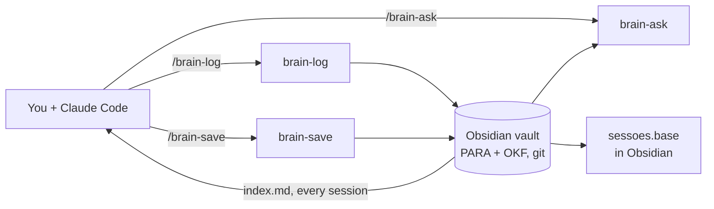

<p align="center">
  
</p>

<h1 align="center">jaiminho-brain</h1>

<p align="center">
  <strong>The mailman for your agent's memory.</strong><br/>
  Delivers every session to your Obsidian vault, and brings it back when you ask.
</p>

<p align="center">
  <a href="#install">install</a> · <a href="#using-it">usage</a> · <a href="#where-notes-live">vault layout</a> · <a href="#session-dashboard">dashboard</a> · <a href="#open-knowledge-format">format</a> · <a href="#commands">commands</a>
</p>

<p align="center">
  English · <a href="README.pt-BR.md">Português</a>
</p>

<p align="center">
  
  <a href="https://agentskills.io"></a>
  
  <a href="https://fortelabs.com/blog/para/"></a>
  <a href="#open-knowledge-format"></a>
  
</p>

---

> **"Evitar a fadiga."** Jaiminho, the mailman from *Chaves*, never walked a
> route twice if he could help it. Neither should you: stop re-explaining last
> week's decision to your agent, and let the agent stop starting from zero.

- **sessions that file themselves** — `/brain-log` writes what was done, the
  decisions and why, the links, and what is still pending, under the right
  project or repo.
- **decisions that stick** — `/brain-save "we picked SQS"` merges into the note
  that already covers it instead of adding another copy.
- **answers with receipts** — `/brain-ask "why SQS?"` walks the indexes, reads
  the notes, and cites every file it used.
- **your rules, everywhere** — working preferences load in every session, in
  every repo, from one line in `~/.claude/CLAUDE.md`.
- **just markdown** — PARA folders, OKF frontmatter, a git repo. Grep it, open
  it in Obsidian, or drop these skills and keep every note.
- **no secrets in the mailbag** — a note says a secret exists, never its value.
- **one `go run`, no node** — `go run . install` links everything; `git pull`
  updates it.

## How it works



## Install

```sh
git clone git@github.com:malaquiasdev/jaiminho-brain.git
cd jaiminho-brain
go run . install
```

`install` symlinks each skill into `~/.claude/skills`, so a `git pull` updates
them in place. `go run . uninstall` reverses it, touching only links that point
into this repo.

To load your brain's preferences in every session, add this line to
`~/.claude/CLAUDE.md`:

```
@~/Documents/brain/index.md
```

## Using it

Type these into Claude Code. Arguments are optional — each skill works out what
is missing from the conversation.

**Log a session**

```
/brain-log                          # names the note from what the session did
/brain-log "round churros prices to the nearest cent"
```

**Put things in** — a fact, a decision, a preference

```
/brain-save "we picked SQS over EventBridge — simpler retries"
/brain-save "always answer yes/no on the first line"   # lands in 2-Areas/claude/preferencias/
/brain-save                         # saves the last decision from the chat, after asking
```

**Get things out**

```
/brain-ask "why did we pick SQS?"
/brain-ask "what did I do on churros-dashboard last week?"
```

Plain phrases work too: "save this to the brain", "log this session", "is
there anything in the brain about X?".

## Where notes live

The vault follows [PARA](https://fortelabs.com/blog/para/) (Tiago Forte): notes are filed by how actionable they are, not by topic.

```
~/Documents/brain/                     override with BRAIN_DIR
  index.md                             PARA + OKF rules, preference list
  1-Projects/SLUG/                     has a goal and an end
  2-Areas/REPO/                        ongoing responsibility, one per repo
  2-Areas/claude/preferencias/NAME.md  rules for how the agent should work
  3-Resources/TOPIC/                   reference and interests
  4-Archives/YEAR/SLUG/                finished projects
  sessoes.base                         session dashboard (see below)
```

Inside each project or area: loose notes at the root (`kebab-slug.md`, one idea per file), session logs in `sessoes/YYYY-MM-DD - TOPIC.md`, and an `index.md`. The format follows the [Open Knowledge Format](#open-knowledge-format). `/brain-log` files a session under the project it advanced, or under the repo's folder in `2-Areas/` by default (found by name, so grouping repos under a parent folder like `2-Areas/<client>/<repo>/` works).

Every write:

- updates an existing note instead of adding a duplicate
- records a secret's existence, never its value
- ends with a commit in the brain's git repo (no push)

## Session dashboard

`templates/sessoes.base` is an [Obsidian Base](https://help.obsidian.md/bases):
a live table over every session note in the vault, built from the frontmatter
`/brain-log` writes.

| View | Shows |
|------|-------|
| Últimos 7 dias | This week's sessions, grouped by day |
| Pendentes | Sessions whose `estado` is `PR aberta` or `não commitado`, outside `4-Archives/` |
| Por projeto/área | Every session, grouped by project or area folder |

**Set it up**

1. Obsidian 1.9 or later, with **Settings → Core plugins → Bases** turned on.
2. Copy the template to the vault root:

   ```sh
   cp templates/sessoes.base "${BRAIN_DIR:-$HOME/Documents/brain}/"
   ```

3. Open `sessoes.base` in Obsidian and pick a view at the top of the table.

It stays empty until the first `/brain-log`. It relies on three things the
skill already does: `type: Session` in the frontmatter, the
`YYYY-MM-DD - topic.md` file name (day and topic come from it), and the
`estado` values above. Edit the `.base` in Obsidian or as YAML to add views or
change what counts as pending; the `obsidian-bases` skill knows the syntax.

## Open Knowledge Format

[Open Knowledge Format](https://cloud.google.com/blog/products/data-analytics/how-the-open-knowledge-format-can-improve-data-sharing)
(OKF) is an open spec, v0.1, that formalizes the "LLM wiki" pattern: knowledge
as a directory of markdown files with YAML frontmatter, plus a few conventions
so any tool or agent can read it. It requires exactly one field per file,
`type`; everything else is up to whoever writes the notes.

### Why the brain follows it

- **Portable.** Plain files, readable in any editor, greppable, versioned with
  git. Nothing is locked to Obsidian or to these skills.
- **Queryable.** A typed note can be filtered: `grep -l '^type: Decision'`, or a
  `type == "Session"` filter in an Obsidian Base.
- **Progressive disclosure.** An agent reads the root `index.md`, then only the
  folder indexes that matter, then the notes. That costs far less context than
  grepping the whole vault.

<details>
<summary><strong>Rules</strong></summary>

| OKF | In the brain |
|-----|--------------|
| Markdown + YAML frontmatter, one concept per file | One idea per file; one session per file |
| The file path is the concept's identity | `2-Areas/vila/aluguel-api/sessoes/2026-09-24 - retry da cobrança.md` |
| `type` is required | Always set, from the list below |
| Standard fields: `title`, `description`, `resource`, `tags`, `timestamp` | Used when they apply; `timestamp` is `YYYY-MM-DD` |
| `index.md` is reserved for navigation | Every folder has one, kept current on every write |
| Links between concepts form a graph | Obsidian `[[wikilinks]]` (see deviations) |

</details>

<details>
<summary><strong>Note types</strong></summary>

| `type` | Used for |
|--------|----------|
| `Index` | A folder's `index.md` |
| `Session` | A session log in `sessoes/` |
| `Project` | A project's overview note: goal and end |
| `Decision` | A choice, with the why and what was rejected |
| `Reference` | A contract, spec, or fact to look up later |
| `Preference` | A rule for how the agent should work |
| `Note` | Anything else |

</details>

<details>
<summary><strong>Examples</strong></summary>

A decision:

```markdown
---
type: Decision
title: SQS over EventBridge
description: "Rent charge retries go through SQS: simpler redrive and DLQ."
timestamp: 2026-09-24
tags: [aluguel-api, aws]
---
# SQS over EventBridge

Rent charge retries go through SQS with a DLQ.

**Por quê:** redrive is one API call; EventBridge archive/replay was more setup for the same result.
```

A folder index:

```markdown
---
type: Index
title: aluguel-api
description: "Repo aluguel-api."
---
# aluguel-api

## Pastas

- [[2-Areas/vila/aluguel-api/sessoes/index|sessoes]] — session logs, newest first

## Notas

- [[2-Areas/vila/aluguel-api/sqs-over-eventbridge|SQS over EventBridge]] — Rent charge retries go through SQS: simpler redrive and DLQ.
```

</details>

<details>
<summary><strong>Deliberate deviations</strong></summary>

- **Wikilinks instead of markdown links.** OKF links with `[text](path.md)`.
  The brain uses `[[wikilinks]]`, which resolve by file name, so moving a
  folder with `git mv` never breaks a link. Every `index.md` shares a name, so
  links to an index use the full path. A non-Obsidian reader sees the text but
  not the graph.
- **Session logs are files in `sessoes/`, not a `log.md`.** OKF reserves
  `log.md` for chronological history. One file per session keeps each session a
  single concept, lets `/brain-log` update it in place, and gives Bases one row
  per session.
- **No luna-notes extras.** [luna-notes](https://github.com/mvfsillva/luna-notes)
  adds `raw/` sources with sha256 provenance and six fixed knowledge types on top
  of OKF. Those are luna conventions, not OKF, and the brain skips them.

</details>

## Bundled: kepano/obsidian-skills

`install` also brings two skills from
[kepano/obsidian-skills](https://github.com/kepano/obsidian-skills) (MIT) that make
the notes more native to Obsidian. It fetches the latest
commit with `git`, prints which one, and symlinks only these two. Rerun
`install` to update; `-obsidian=false` skips them, since the three brain skills
work on plain files without them. These run with full agent permissions and are not reviewed on update.

| Skill | What it adds |
|-------|--------------|
| `obsidian-markdown` | Correct Obsidian syntax in the notes: `[[Note#Heading]]` links, embeds, callouts, typed properties |
| `obsidian-bases` | Writing `.base` files — table views over the vault's frontmatter, like the [session dashboard](#session-dashboard) |

## Commands

| Command | Purpose |
|---------|---------|
| `/brain-log [topic]` | Write or update this session's note under the matching project or area |
| `/brain-save "<fact>"` | File a fact, decision, or preference, merging into an existing note when one covers it |
| `/brain-ask "<question>"` | Answer from the notes, citing each one; read-only |
| `go run . install [-obsidian=false]` | Symlink the brain skills and the two kepano skills into `~/.claude/skills` |
| `go run . uninstall` | Remove those symlinks, kepano's included |

## Development

```sh
go test ./...
go vet ./...
```

The skills are plain `SKILL.md` files under `skills/`; edit them and the
symlinks pick up the change on the next session.

---

<p align="center">
  <sub>Named after Jaiminho, the mailman from <em>El Chavo del Ocho</em>, who carries the letters so nobody has to walk.</sub>
</p>
