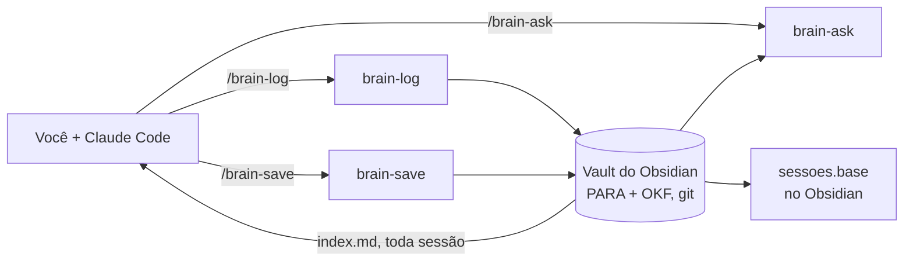

<p align="center">
  
</p>

<h1 align="center">jaiminho-brain</h1>

<p align="center">
  <strong>O carteiro da memória do seu agente.</strong><br/>
  Entrega cada sessão no seu vault do Obsidian, e traz de volta quando você pede.
</p>

<p align="center">
  <a href="#instalar">instalar</a> · <a href="#como-usar">uso</a> · <a href="#onde-as-notas-ficam">vault</a> · <a href="#open-knowledge-format">formato</a> · <a href="#comandos">comandos</a>
</p>

<p align="center">
  <a href="README.md">English</a> · Português
</p>

<p align="center">
  
  <a href="https://agentskills.io"></a>
  
  <a href="https://fortelabs.com/blog/para/"></a>
  <a href="#open-knowledge-format"></a>
  
</p>

---

> **"Evitar a fadiga."** O Jaiminho nunca fazia a mesma rota duas vezes se
> desse pra evitar. Nem você: pare de explicar de novo pro agente a decisão da
> semana passada, e deixe o agente parar de começar do zero.

- **sessões que se registram** — o `/brain-log` escreve o que foi feito, as
  decisões e o porquê, os links e o que ficou pendente, no projeto ou repo
  certo.
- **decisões que ficam** — `/brain-save "escolhemos SQS"` junta na nota que já
  cobre o assunto em vez de criar mais uma cópia.
- **respostas com recibo** — `/brain-ask "por que SQS?"` desce pelos índices, lê
  as notas e cita cada arquivo que usou.
- **suas regras, em todo lugar** — as preferências de trabalho carregam em toda
  sessão, em todo repo, a partir de uma linha no `~/.claude/CLAUDE.md`.
- **só markdown** — pastas PARA, frontmatter OKF, um repo git. Faça grep, abra no
  Obsidian, ou largue estas skills e fique com todas as notas.
- **nada de segredo na sacola** — a nota diz que um segredo existe, nunca o valor.
- **um `go run`, sem node** — `go run . install` liga tudo; `git pull` atualiza.

## Como funciona



## Instalar

```sh
git clone git@github.com:malaquiasdev/jaiminho-brain.git
cd jaiminho-brain
go run . install
```

O `install` cria um symlink de cada skill em `~/.claude/skills`, então um
`git pull` já atualiza as skills. `go run . uninstall` desfaz, mexendo só nos
links que apontam pra este repo.

Pro Claude carregar as preferências do brain em toda sessão, adicione esta
linha em `~/.claude/CLAUDE.md`:

```
@~/Documents/brain/index.md
```

## Como usar

Digite no Claude Code. Os argumentos são opcionais: cada skill tira o que
falta da conversa.

**Registrar a sessão**

```
/brain-log                          # dá nome à nota a partir do que a sessão fez
/brain-log "restaurar dashboard sem websocket"
```

**Guardar** — um fato, uma decisão, uma preferência

```
/brain-save "escolhemos SQS em vez de EventBridge — retry mais simples"
/brain-save "sempre responder sim/não na primeira linha"   # vai pra 2-Areas/claude/preferencias/
/brain-save                         # salva a última decisão da conversa, depois de confirmar
```

**Consultar**

```
/brain-ask "por que escolhemos SQS?"
/brain-ask "o que eu fiz no churros-dashboard semana passada?"
```

Frases soltas também funcionam: "salva isso no brain", "registra essa sessão",
"tem algo no brain sobre X?".

## Onde as notas ficam

O vault segue o [PARA](https://fortelabs.com/blog/para/) (Tiago Forte): as notas ficam organizadas por quão acionáveis são, não por tema.

```
~/Documents/brain/                     troque com BRAIN_DIR
  index.md                             regras do PARA e do OKF, lista de preferências
  1-Projects/SLUG/                     tem objetivo e fim
  2-Areas/REPO/                        responsabilidade contínua, uma por repo
  2-Areas/claude/preferencias/NOME.md  regras de como o agente deve trabalhar
  3-Resources/TEMA/                    referência e interesses
  4-Archives/ANO/SLUG/                 projetos concluídos
```

Dentro de cada projeto ou área: notas soltas na raiz (`slug-kebab.md`, uma ideia por arquivo), registros de sessão em `sessoes/AAAA-MM-DD - ASSUNTO.md` e um `index.md`. O formato segue o [Open Knowledge Format](#open-knowledge-format). O `/brain-log` registra a sessão no projeto que ela avançou, ou na pasta do repo em `2-Areas/` por padrão (achada pelo nome, então agrupar repos numa pasta-mãe como `2-Areas/<cliente>/<repo>/` funciona).

Toda escrita:

- atualiza uma nota existente em vez de criar duplicata
- registra que um segredo existe, nunca o valor dele
- termina com um commit no repo git do brain (sem push)

## Open Knowledge Format

O [Open Knowledge Format](https://cloud.google.com/blog/products/data-analytics/how-the-open-knowledge-format-can-improve-data-sharing)
(OKF) é uma especificação aberta, v0.1, que formaliza o padrão "wiki pra LLM":
conhecimento como uma pasta de arquivos markdown com frontmatter YAML, mais
algumas convenções pra qualquer ferramenta ou agente conseguir ler. Ela exige
um único campo por arquivo, `type`; o resto fica a critério de quem escreve.

### Por que o brain segue o OKF

- **Portável.** Arquivos puros, legíveis em qualquer editor, buscáveis com grep
  e versionados com git. Nada fica preso ao Obsidian nem a estas skills.
- **Consultável.** Nota com tipo pode ser filtrada: `grep -l '^type: Decision'`,
  ou um filtro `type == "Session"` numa Base do Obsidian.
- **Leitura progressiva.** O agente lê o `index.md` da raiz, depois só os
  índices das pastas que importam, depois as notas. Gasta bem menos contexto do
  que fazer grep no vault inteiro.

<details>
<summary><strong>Regras</strong></summary>

| OKF | No brain |
|-----|----------|
| Markdown + frontmatter YAML, um conceito por arquivo | Uma ideia por arquivo; uma sessão por arquivo |
| O caminho do arquivo é a identidade do conceito | `2-Areas/vila/aluguel-api/sessoes/2026-09-24 - retry da cobrança.md` |
| `type` obrigatório | Sempre preenchido, com um dos tipos abaixo |
| Campos padrão: `title`, `description`, `resource`, `tags`, `timestamp` | Usados quando fazem sentido; `timestamp` é `AAAA-MM-DD` |
| `index.md` reservado pra navegação | Toda pasta tem um, atualizado a cada escrita |
| Links entre conceitos formam um grafo | `[[wikilinks]]` do Obsidian (ver diferenças) |

</details>

<details>
<summary><strong>Tipos de nota</strong></summary>

| `type` | Usado pra |
|--------|-----------|
| `Index` | O `index.md` de uma pasta |
| `Session` | Registro de sessão em `sessoes/` |
| `Project` | Nota de visão geral de um projeto: objetivo e fim |
| `Decision` | Uma escolha, com o porquê e o que foi descartado |
| `Reference` | Contrato, spec ou fato pra consultar depois |
| `Preference` | Regra de como o agente deve trabalhar |
| `Note` | Todo o resto |

</details>

<details>
<summary><strong>Exemplos</strong></summary>

Uma decisão:

```markdown
---
type: Decision
title: SQS em vez de EventBridge
description: "Retry da cobrança do aluguel passa pelo SQS: redrive e DLQ mais simples."
timestamp: 2026-09-24
tags: [aluguel-api, aws]
---
# SQS em vez de EventBridge

Retry da cobrança do aluguel passa pelo SQS com DLQ.

**Por quê:** redrive é uma chamada de API; archive/replay do EventBridge exigia mais configuração pro mesmo resultado.
```

O índice de uma pasta:

```markdown
---
type: Index
title: aluguel-api
description: "Repo aluguel-api."
---
# aluguel-api

## Pastas

- [[2-Areas/vila/aluguel-api/sessoes/index|sessoes]] — registros de sessão, mais recentes primeiro

## Notas

- [[2-Areas/vila/aluguel-api/sqs-em-vez-de-eventbridge|SQS em vez de EventBridge]] — Retry da cobrança do aluguel passa pelo SQS: redrive e DLQ mais simples.
```

</details>

<details>
<summary><strong>Diferenças conscientes</strong></summary>

- **Wikilinks em vez de links markdown.** O OKF liga com `[texto](caminho.md)`.
  O brain usa `[[wikilinks]]`, que resolvem pelo nome do arquivo, então mover
  uma pasta com `git mv` nunca quebra um link. Todo `index.md` tem o mesmo
  nome, então link pra índice usa o caminho completo. Um leitor fora do
  Obsidian vê o texto, mas não o grafo.
- **Sessões são arquivos em `sessoes/`, não um `log.md`.** O OKF reserva o
  `log.md` pro histórico cronológico. Um arquivo por sessão mantém cada sessão
  como um conceito só, deixa o `/brain-log` atualizar a nota no lugar e dá uma
  linha por sessão nas Bases.
- **Sem os extras da luna-notes.** A [luna-notes](https://github.com/mvfsillva/luna-notes)
  acrescenta fontes em `raw/` com proveniência por sha256 e seis tipos fixos de
  conhecimento por cima do OKF. São convenções da luna, não do OKF, e o brain
  não usa.

</details>

## Incluídas: kepano/obsidian-skills

O `install` também traz duas skills do [kepano/obsidian-skills](https://github.com/kepano/obsidian-skills)
(MIT) que deixam as notas mais nativas do Obsidian. Ele baixa o commit mais recente com `git`, mostra qual foi e cria symlink só dessas
duas. Rode o `install` de novo pra atualizar; `-obsidian=false` pula as duas,
já que as três skills do brain funcionam só com arquivos. Elas rodam com permissão total do agente e não
são revisadas a cada atualização.

| Skill | O que acrescenta |
|-------|------------------|
| `obsidian-markdown` | Sintaxe certa do Obsidian nas notas: links `[[Nota#Heading]]`, embeds, callouts, propriedades tipadas |
| `obsidian-bases` | Arquivos `.base` — visões em tabela sobre o frontmatter do vault, por exemplo um `sessoes.base` com as sessões dos últimos 7 dias, as pendentes e por projeto/área |

## Comandos

| Comando | Para quê |
|---------|----------|
| `/brain-log [assunto]` | Escreve ou atualiza a nota desta sessão no projeto ou área certa |
| `/brain-save "<fato>"` | Registra fato, decisão ou preferência, juntando numa nota existente quando uma já cobre o assunto |
| `/brain-ask "<pergunta>"` | Responde a partir das notas, citando cada uma; só leitura |
| `go run . install [-obsidian=false]` | Cria os symlinks das skills do brain e das duas do kepano em `~/.claude/skills` |
| `go run . uninstall` | Remove esses symlinks, inclusive os do kepano |

## Desenvolvimento

```sh
go test ./...
go vet ./...
```

As skills são arquivos `SKILL.md` em `skills/`; edite e os symlinks pegam a
mudança na próxima sessão.

---

<p align="center">
  <sub>O nome vem do Jaiminho, o carteiro do <em>Chaves</em>, que leva as cartas pra ninguém precisar andar.</sub>
</p>
